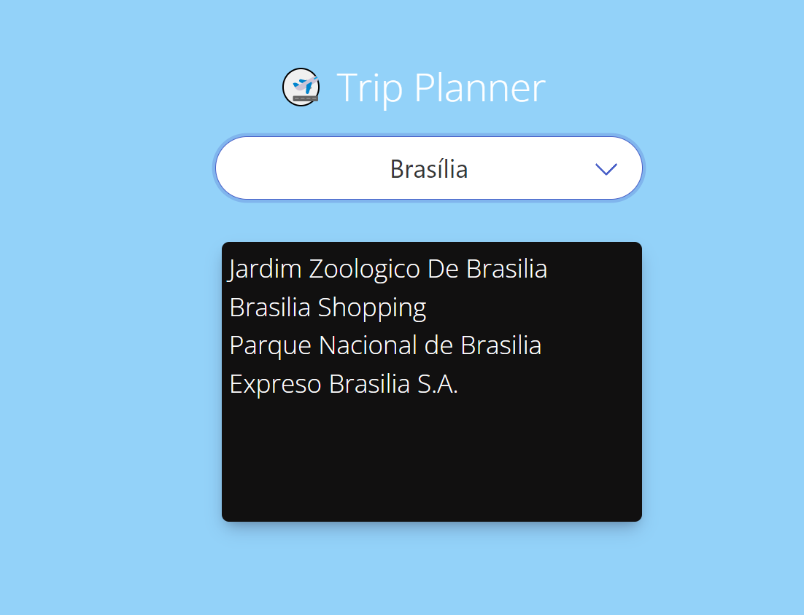

# Trip Planner

## Description

In this bootcamp project, there was a lot of freedom on what to do. As long as two server side APIs were effectively utilized, the project topic could be related to anything. As a group, we decided to develop an application that allows the user to select a capital city from anywhere in the world, and upon selection, the main attractions for the selected capital city will be displayed. Our first API (Rest Countries) is being utilized to pull all the capital cities in the world, while our second API (TripAdvisor) will pull the attractions based upon the selected capital city by the user. Furthermore, we added in a modal with a airplane figure in order to help if the user is unsure of which cities to search for, and upon the modal being clicked, it will list the top 10 most touristic capital cities to visit. This project definitely extracted all four of us to further enhance not only our coding skills, but our GitHub skills as well.

## Installation

N/A

## Usage

This web application usage will target the audience of users who are interested in learning about attractions based on any capital city in the world. 

<a href="https://github.com/wkerby/trip-planner">Deployed Website Link</a>

## Credits

GA Tech bootcamp activities & challenges information.
GA Tech bootcamp instructor & TAs.
